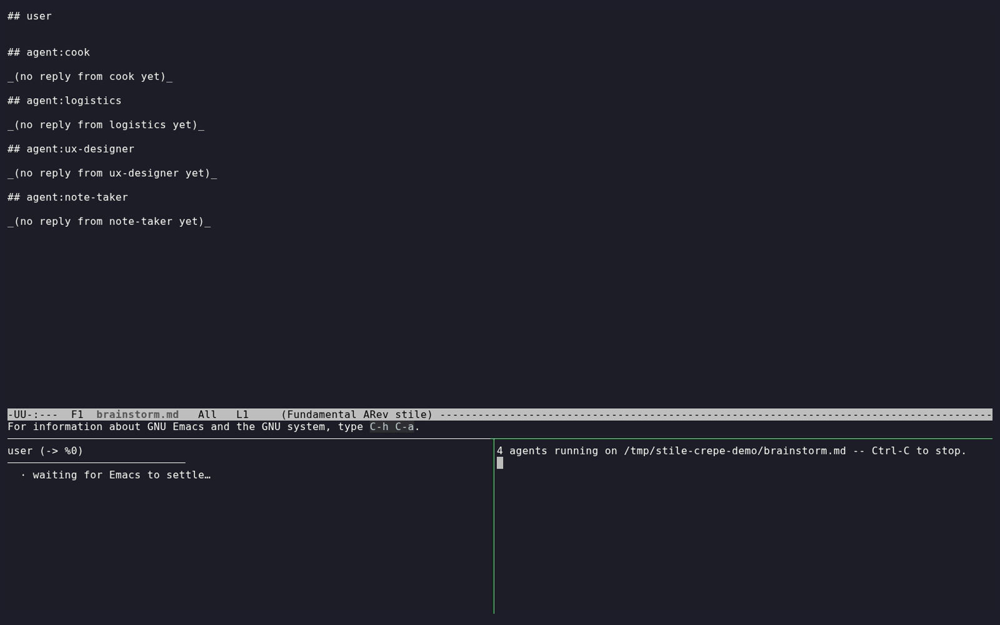

# cotype

[](https://pypi.org/project/cotype/)
[](https://github.com/yurug/cotype/actions/workflows/test.yml)
[](LICENSE)

> **Safe concurrent saves for a single text file.**

Cotype is a tiny Unix CLI that lets many actors — a person in their editor, an LLM-driven agent, a formatter, a build hook, a sync script, anything — save changes to the **same text file at the same time** without losing each other's edits. Three-way merge for disjoint edits; inline diff3 markers when the merge can't be automatic; atomic file replacement always.



*One use case among many (see [chorale](https://github.com/yurug/chorale) below): three Claude personas plus a note-taker design a school crêpe stand with the user — all in one `brainstorm.md`. Cotype reconciles every save in the background.*

---

## Install

```bash
pip install cotype
```

Requires Python ≥ 3.11 and POSIX `diff3` (`diffutils`, on every Linux/macOS).

> ⚠️ **For the live in-editor experience** (your buffer updates as other actors write), install one of the editor companions:
>
> - **Emacs**: [`cotype-mode`](editors/emacs/) — [submitted to MELPA](https://github.com/melpa/melpa/pull/9998).
> - **vim / neovim**: [pure-vimscript plugin](editors/vim/) — vim-plug / lazy.nvim / packer install snippets in the README.
> - **VS Code**: in progress.
>
> Without one of these, cotype still works (the CLI is editor-agnostic) but each agent reply lands in the file and you have to manually reload your editor to see it — the magic falls flat.

## How it works

Three commands cover the protocol:

```bash
cotype init  FILE                  # start managing a file
cotype open  FILE --json           # capture a base; returns base_sha + base_path
cotype save  FILE --base-sha SHA   # submit new bytes (stdin) against the base
```

Every actor follows the same flow — there is no privileged path. Each `save` returns one of:

| outcome    | meaning                                                     |
|------------|-------------------------------------------------------------|
| `direct`   | base matched current; bytes written atomically              |
| `merged`   | 3-way merge produced a clean result                         |
| `noop`     | proposed equals current; nothing to do                      |
| `conflict` | FILE rewritten with diff3 markers; resolve inline with `cotype resolve` |

`cotype --help` prints the protocol, the four outcomes, exit codes, and a copy-paste shell template — enough for an agent to operate the tool from a sandbox without reading any other docs.

## Use cases

Anything where one regular text file is the unit of collaboration:

- **AI agents brainstorming with a human** — see [`chorale`](https://github.com/yurug/chorale): `pip install chorale && chorale brainstorm.md cook logistics ux-designer` runs N agents (Claude / Gemini / Codex / Ollama / custom) on a shared Markdown file, each owning its own section. The demo above is one chorale invocation.
- **Your editor and a formatter racing on the same file** — `prettier --write` (or `black`, or `gofmt`) running on save no longer overwrites in-progress edits; the loser auto-merges or surfaces a conflict explicitly.
- **A long-running watcher concurrent with a human edit** — a build hook updating a manifest, a sync agent writing config, etc., all running while someone edits in vim or VS Code. No "X has changed since visited" prompt avalanche.
- **Anything that fits the pattern**: regular text file, multiple writers, two CLI calls per actor (`open`, then `save`). No daemon, no event log, no privileged actor.

## Documentation

| Where | What |
|---|---|
| `cotype --help` | Self-describing; the full protocol fits on one screen. |
| [`cli/README.md`](cli/README.md) | CLI reference: every command, flag, exit code, error name, caller protocols. |
| [`editors/emacs/`](editors/emacs/), [`editors/vim/`](editors/vim/) | `cotype-mode` (Emacs) and the vim/neovim plugin — live-experience companions. |
| [github.com/yurug/chorale](https://github.com/yurug/chorale) | Multi-agent harness on top of cotype (the use case in the demo). |
| [`kb/`](kb/) | Normative spec, properties, ADRs, design notes. Agent-readable. |
| [`examples/headless-agents.sh`](examples/headless-agents.sh) | The 100-line bash recipe chorale was extracted from. |
| [`CHANGELOG.md`](CHANGELOG.md) | Per-release notes. |

## Philosophy

Cotype does *one* thing: prevent lost updates when many actors write the same text file. No daemon, no event log, no CRDT, no network sync, no semantic edits, no multi-file transactions. The PRD's [non-goals list](kb/domain/prd.md) is load-bearing. Reach for git when you want project-wide history; reach for cotype when one file is the unit of collaboration.

## License

MIT. See [LICENSE](LICENSE).
